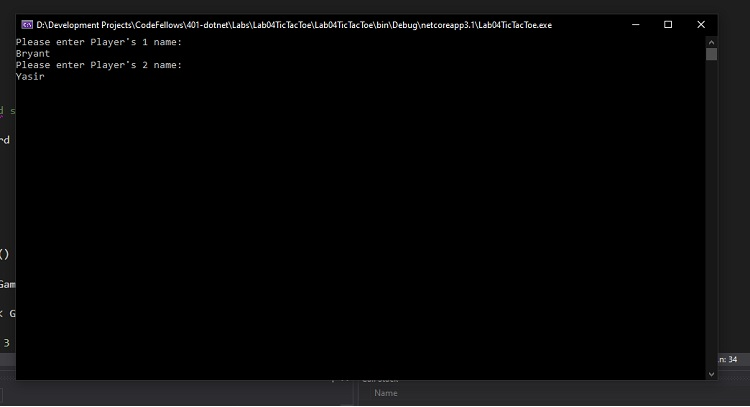
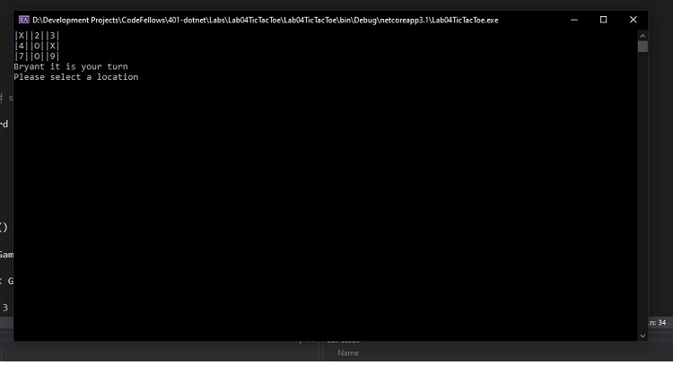
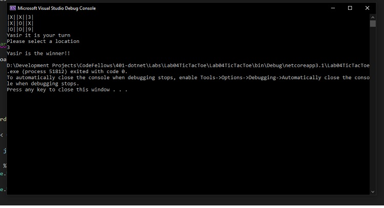

# Lab04: Tic-Tac-Toe

## About us

Lab04: Tic-Tac-Toe

- *Author: Yasir Mohamud*
- *Author: Bryant Davis*
- *Author: Trevor Stubbs*

----

## Description
***[Tell me about your application, should be about a paragraph]***
This is a C# console application console where users get to play TIC TAC TOE.

---

### Getting Started
Clone this repository to your local machine.

```
$ git clone [https://github.com/Bryant-Yasir-Trevor/Lab04TicTacToe.git]
```

### To run the program from Visual Studio:
Select ```File``` -> ```Open``` -> ```Project/Solution```

Next navigate to the location you cloned the Repository.

Double click on the ```Lab04TicTacToe``` directory.

Then select and open ```Lab04TicTacToe.sln```

---

### Visuals

#### Application Start

#### Using the Application

#### Application End


---

### Change Log
1.8: All tests are passing
1.7: Give user a response and stop game if it was a tie
1.6: Stop players from placing marker in same location
1.5: Display winner
1.4: Display game board to users and see where their marker is on the board
1.3: Allow users to enter cordinates
1.2: Allow users to enter names
1.1: Inital Repo Setup


------------------------------
For more information on Markdown: https://www.markdownguide.org/cheat-sheet